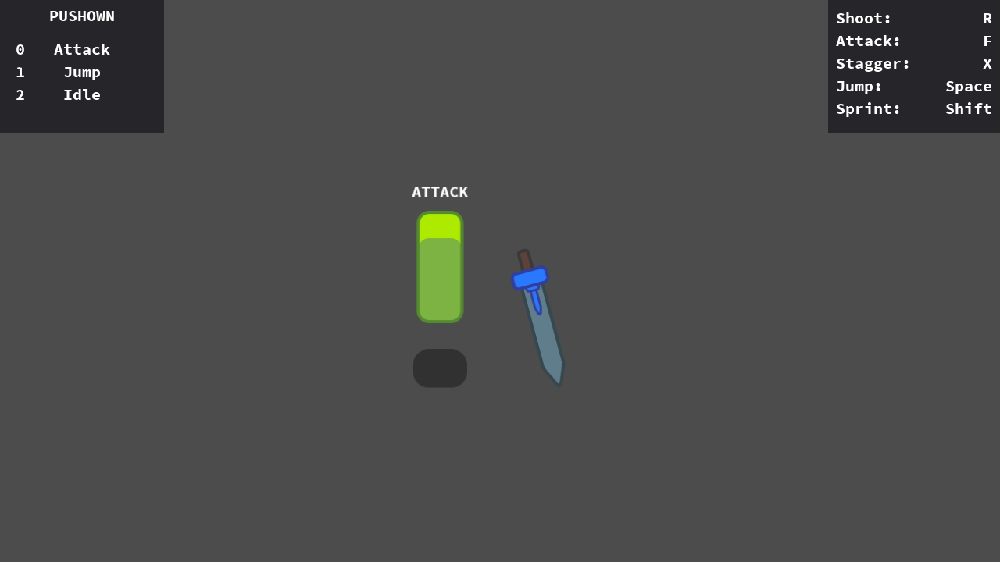

# Hierarchical Finite State Machine To Modular Character Controller

**Modular Character Controller:** v3.0 \
**Godot:** v4.4

This is an example of the [Modular Character Controller](https://github.com/PantheraDigital/Modular-Character-Controller-for-Godot) within an official Godot Demo. 

This project shows a side by side of a state machine and the Modular Character Controller used to make the same character.

The bulk of the main scripts at play are in the "player" and "player(2)" folders, with the Modular Character Controller scripts being in the "player(2)" folder.

Notes on the state machine are also included in the "notes.txt" file, which I used to break down the state machine and remake it with Actions. Some states and functionality seem to have been set up for future additions, such as the damage system.

Note that the character with the Modular Character Controller setup makes use of a simple state machine for processing physics.

  
**Original Project:** 

[**Hierarchical Finite State Machine**](https://godotengine.org/asset-library/asset/516)

