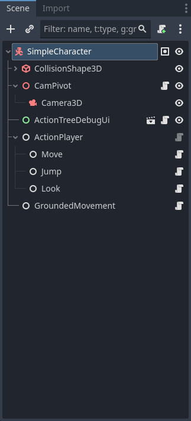
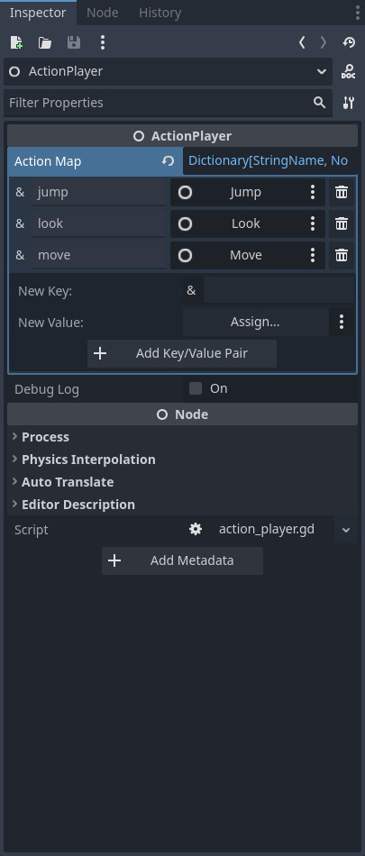
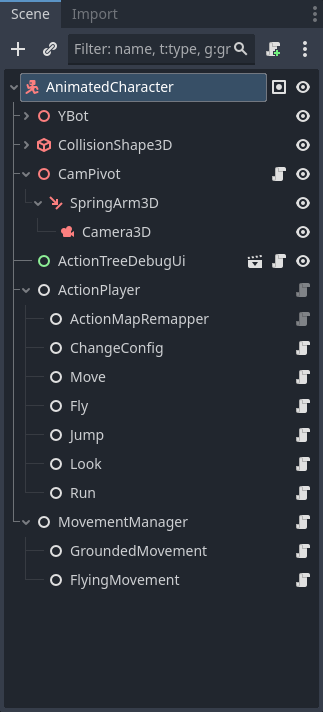
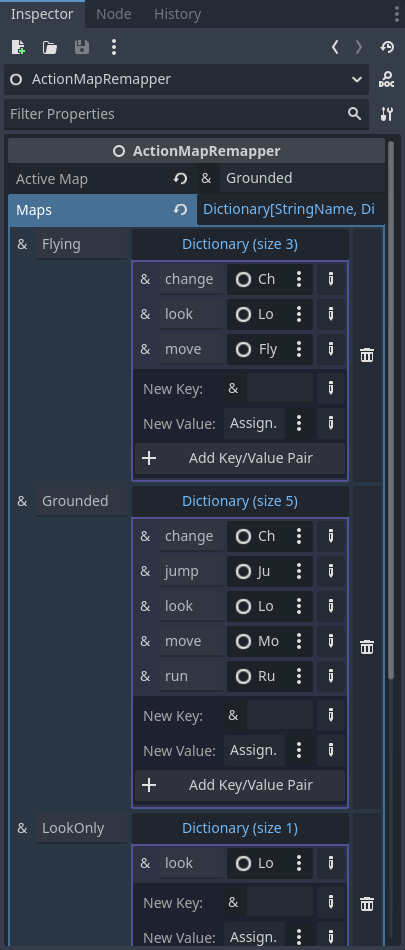

# Generic Character 3D
**Modular Character Controller:** v3.0.1 \
**Godot:** v4.4 - 4.6

[Demo video](https://www.youtube.com/watch?v=S7sfsYb2C7Q)

This project is an example of 3D characters using the [Modular Character Controller](https://github.com/PantheraDigital/Modular-Character-Controller-for-Godot). 

In the level there are two characters. One is the Simple Character (first person) and the other the Animated Character (third person). The Simple Character is the equivalent of using Godot's CharacterBody3D's Basic Movement template script. The Animated Character uses a more complex set up to display a more common set of actions a character may have, including the use of root motion and actions blocking or interrupting each other. Use the dash action to see these at play (jump can interrupt the dash after about half the slide).

In the level is also a purple cube that will add a "Dash" action to any character that walks into it.

**Included:**
- two example characters
  - [simple](scenes/SimpleCharacter.tscn) : This displays the Godot CharacterBody3D Basic Movement template adapted to this system.
  - [animated](scenes/AnimatedCharacter.tscn) : An animated character using more of the features this system provides (a closer representation of the average playable character).
- [demo level](scenes/Level.tscn) : A scene with both characters set up to allow the player to swap between them.
- [action pickup](scenes/DashPickup.tscn) : An example of an object adding an action to a character at runtime.

**Controls:** 
- w,a,s,d: _move_ 
- mouse: _look_ 
- space: _jump_ 
- alt: _dash_ (after walking into pickup) 
- tab: _swap characters_

Third person character specific controls: 
- shift: _run_ 
- double tap space: _toggle flying_ 
- q/e (while flying): _fly up/fly down_

**Character Behavior:** \
_See scripts for more details._ 

--Simple Character-- \
Actions:
 - move
 - jump
 - look
 - dash (added by pickup)
   - prevents: move

Physics:
 - ground based

--Animated Character-- \
Actions:
 - move (ground/flying)
 - jump
 - look
 - run
 - dash (added by pickup)
   - prevents actions based on ainm command signals
   - blocks all but look; blocks all but look and jump; blocks all but look, jump, and move

Physics:
 - ground 
 - flying

Anims Change Action Map: \
_FallToLand_
 - look_only, grounded

_FallToRoll_
 - look_only, grounded

_Slide (from dash)_
 - look_only, look_only + jump, look_only + jump + move

