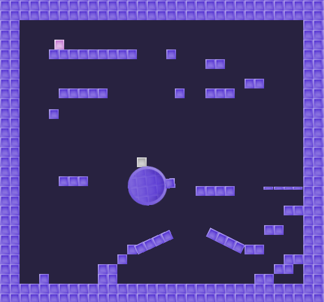

# Modular Kinematic Character 2D

**Modular Character Controller:** v3.0 \
**Godot:** v4.5

This is an example of the [Modular Character Controller](https://github.com/PantheraDigital/Modular-Character-Controller-for-Godot) within an official Godot Demo. 

The demo shows how a controller can be used to create a replay system. The inputs are tracked from the player controller then, when the level is reloaded, fed into a dummy controller for the character to replay the player's actions.

The project is largely the same and the original character is left for reference. Both the original and new players can be found in the "player" folder. The modular character is the one in the world scene. 

**Controls:**
- w,a,s,d: move
- space: jump
- backspace: reload level

  
**Original Project:** 

[**Kinematic Character 2D**](https://godotengine.org/asset-library/asset/113)

